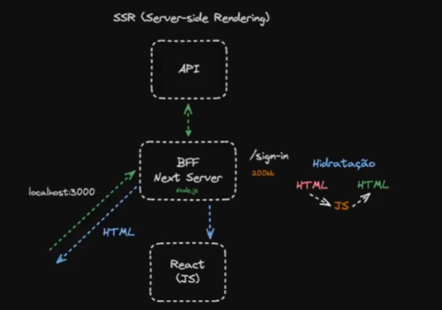

# Fundamentos do Next.js

Este documento apresenta os principais conceitos da nova arquitetura do Next.js, destacando como o framework equilibra renderização no servidor e no cliente para entregar aplicações performáticas.

---

## Tríade do Next.js

1. **Server Components**

   * Renderizados no servidor (Node.js).
   * A versão inicial do HTML é gerada no servidor do Next.

2. **Client Components**

   * Também utilizam renderização, mas o HTML resultante é hidratado com JavaScript no cliente.
   * Permitem interatividade após a entrega da página.

3. **Streaming SSR**

   * Permite o envio de fragmentos de página conforme os dados vão ficando disponíveis.
   * Mantém a conexão aberta para adicionar novos dados ao longo do tempo.

> **Nota:** quanto menos diretivas `use client` você utilizar, mais rápida será a resposta ao usuário, pois reduz-se o payload de JavaScript enviado ao cliente.

---

## Boundaries (Limites)

* **Client Boundaries**: ao importar um componente dentro de um *client component*, este também se torna um componente do cliente.
* **Server Boundaries**: componentes que não importam nada do cliente permanecem no servidor.

---

## Encadeamento de Componentes

Por meio da propriedade `children`, é possível:

* Renderizar componentes no servidor
* Utilizá-los dentro de componentes do cliente

Isso permite manter lógica e marcação server-side, aproveitando interatividade apenas onde for necessário.

---

> **Objetivo da arquitetura**: enviar menos JavaScript para o navegador, tornando as aplicações mais performáticas e responsivas.

---

## Fluxo do Next.js (BFF)

A seguir, um diagrama ilustrando o fluxo de dados entre cliente, Next.js e Back-end For Front-end (BFF):



---

## Getting Started

Este é um projeto [Next.js](https://nextjs.org) inicializado com [`create-next-app`](https://nextjs.org/docs/app/api-reference/cli/create-next-app).

### Instruções de execução

Primeiro, execute o servidor de desenvolvimento:

```bash
npm run dev
# ou
yarn dev
# ou
pnpm dev
# ou
bun dev
```

Abra [http://localhost:3000](http://localhost:3000) no seu navegador para ver o resultado.

Você pode começar a editar a página modificando `app/page.tsx`. A página atualiza automaticamente conforme você edita o arquivo.

Este projeto utiliza [`next/font`](https://nextjs.org/docs/app/building-your-application/optimizing/fonts) para otimizar e carregar automaticamente a fonte [Geist](https://vercel.com/font), uma nova família de fontes da Vercel.

---

## Learn More

Para saber mais sobre Next.js, confira os seguintes recursos:

* [Next.js Documentation](https://nextjs.org/docs) – aprenda sobre recursos e API do Next.js.
* [Learn Next.js](https://nextjs.org/learn) – um tutorial interativo de Next.js.

Você também pode explorar o [repositório do Next.js no GitHub](https://github.com/vercel/next.js) – seu feedback e contribuições são bem-vindos!

---

## Deploy on Vercel

A maneira mais fácil de implantar sua aplicação Next.js é usar a [plataforma Vercel](https://vercel.com/new?utm_medium=default-template&filter=next.js&utm_source=create-next-app&utm_campaign=create-next-app-readme), dos criadores do Next.js.

Consulte nossa [documentação de deploy do Next.js](https://nextjs.org/docs/app/building-your-application/deploying) para mais detalhes.

---

*Documento gerado em 17/07/2025.*
